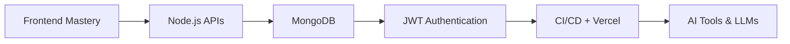
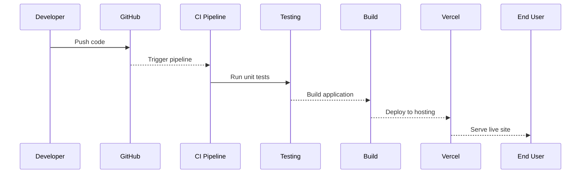

# 🎨 Nisha Yadav — Front-End → Full-Stack Developer

JavaScript developer with **5+ years** of experience building scalable UI applications using **Angular, Vue, and React**.  
Currently expanding into **Node.js & MongoDB** and exploring **AI + developer tooling**.

---

## 📚 Table of Contents
- [About](#about)
- [Tech Stack](#tech-stack)
- [Projects](#projects)
- [Learning Path](#learning-path)
- [Workflow](#workflow)
- [Hobbies](#hobbies)
- [Resources](#resources)
- [Connect](#connect)

---

## 👩‍💻 About

Front-end focused engineer experienced in:
- UI dashboards & performance optimization
- Unit testing (Jasmine, Karma)
- Agile teams & CI/CD (GitLab, Jenkins, Rally)

Now transitioning into **Full-Stack development** with backend APIs and databases.

---

## 🧰 Tech Stack

| Category | Tools |
|---------|-------|
| Frontend | Angular, Vue.js, React, HTML, CSS |
| Backend | Node.js, Express.js |
| Database | MongoDB |
| Testing | Jasmine, Karma |
| DevOps | GitLab, Jenkins |
| Tools | GitHub, Vercel, Postman |

---

## 🚀 Projects

| Project | Description | Live | Repo |
|--------|----------------|------|------|
| **Developer Study Hub** | Web dev interview prep | [Live](https://lazyraven.github.io/developer-study-hub/) | [Repo](https://github.com/lazyraven/developer-study-hub) |
| **Open Retro React** | Work history tracker | [Live](https://www.openretro.in/) | [Repo](https://github.com/lazyraven/open-retro-react) |
| **React Todo App** | Auth + CRUD Todo | [Live](https://lazyraven.github.io/react-todo-app-cursor/) | [Repo](https://github.com/lazyraven/react-todo-app-cursor) |
| **Full-Stack Roadmap** | Interview daily tracker | [Live](https://fullstack-interview-roadmap.netlify.app/) | [Repo](https://github.com/lazyraven/2025-all-coding-learning/tree/main/react-roadmap) |
| **User Finder App** | ChatGPT + API demo | [Live](https://user-finder-app-chatgpt.netlify.app/) | [Repo](https://github.com/lazyraven/2025-all-coding-learning/tree/main/user-finder-app) |
| **Firebase Roadmap** | Full-stack roadmap | [Live](https://roadmap-fullstack.netlify.app/) | [Repo](https://github.com/lazyraven/learning-enhancement-practice) |
| **JWT Auth Project** | Auth + APIs | — | [Repo](https://github.com/lazyraven/jwtprojectauth-fullstack) |
| **Vue Keep Notes** | Notes app | — | [Repo](https://github.com/lazyraven/vue-keep-notes) |
| **JS Lessons** | JS learning repo | — | [Repo](https://github.com/lazyraven/JavaScriptLessons) |
| **HTML Learning** | HTML practice | [Live](https://lazyraven.github.io/LearnHtml/) | [Repo](https://github.com/lazyraven/LearnHtml) |

---

## 🧠 Learning Path

---

## 🔁 Workflow

---

## 📎 Resources
| Resource             | Link                                                           |
| -------------------- | -------------------------------------------------------------- |
| JavaScript Reference | [https://developer.mozilla.org](https://developer.mozilla.org) |
| React Docs           | [https://react.dev](https://react.dev)                         |
| Vue Docs             | [https://vuejs.org](https://vuejs.org)                         |
| Angular Docs         | [https://angular.io](https://angular.io)                       |
| Node.js Docs         | [https://nodejs.org](https://nodejs.org)                       |
| MongoDB Docs         | [https://mongodb.com](https://mongodb.com)                     |
| AI Prompting         | [https://learnprompting.org](https://learnprompting.org)       |

---

## 🎨 Hobbies
| Interest             | Emoji |
| -------------------- | ----- |
| Painting & Sketching | 🖌️   |
| Dancing              | 💃    |
| Music                | 🎶    |
| Creative Tech        | 🚀    |

---
## 🌐 Connect
LinkedIn: https://www.linkedin.com/in/nishayadav1703/
